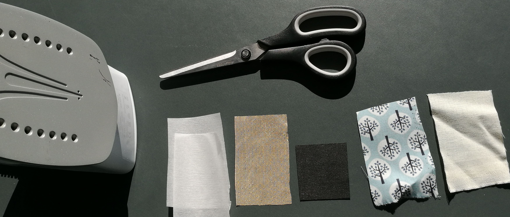
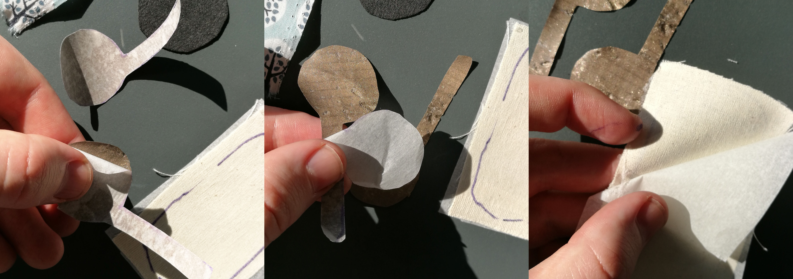

Basic instructions on how to assemble the sample package. Additional, more detailed interactions can be found in our [instructables](https://www.instructables.com/id/ZPatch-Hybrid-ResistiveCapacitive-ETextile-Input/)

EDIT: 20/3/2018 - I received a lot of specific questions while demoing and handing out sample-kits. I will be gradually updating these instructions to address these during the next days. Feel free to also e-mail me at paul dot strohmeier at gmail dot com.

# Do you have all tools and materials?

Tools: Iron, Scissors
Materials: 2x Dual sided bonding, Conductive Ripstop, Piezo Resistive fabric, Decorative cover, Calico backing

# Iron Bonding on to Calico Backing and and Conductive Ripstop. 
(Protect your ironing board and iron with extra wax paper)

# Cut
Using the paper template we provided, cut the piezo resistive material and the conductive material to the desired shapes.

# Remove Backing layers

Peel off the backing layer from the dual sided bonding.

# Stack

Stack your layers, 

(from left to right, bottom to top)

* Bonding (glue facing up) [Bottom]
* Conductive electrode (glue facing down)
* Piezo Resistive Fabric 
* Conductive electrode (glue facing up)
* Decorative top layer

# Iron

Iron it all together & cut them to shape

# Program

Connect it to two analog input pins of an Arduino (A0 and A1 in the example code) and upload [the following code](https://github.com/zPatch/zPatch.github.io/tree/master/ArduinoCode/fabricSensor) https://github.com/zPatch/zPatch.github.io/tree/master/ArduinoCode/fabricSensor 
